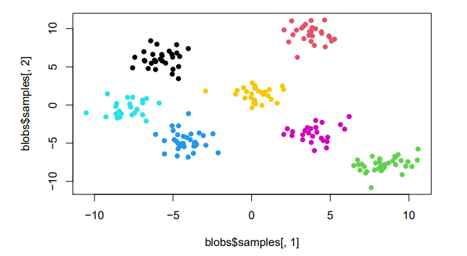
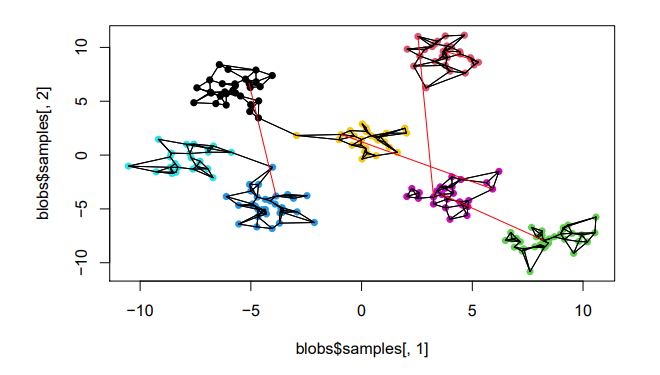
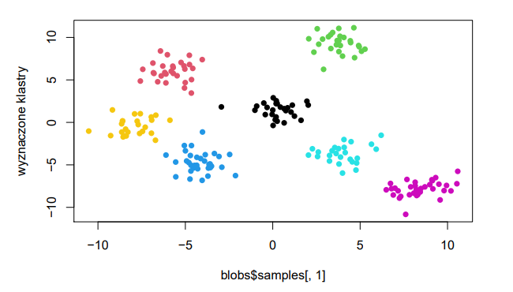

# Spectral crustering from scratch (R language)
Implementation of spectral clustering

## Images
1. generated blobs in which we try to detect clusters

2. connecting a graph (red lines are used to make the graph connected)

3. detected clusters

